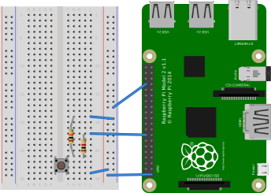

# Raspberry Pi and a button

> Note. The setup and code uses the GPIO `BOARD` mode. Generally `BCM` is used.

This is one of the simplest things you can do to demonstrate a Raspberry Pi interfacing with a circuit over GPIO.

Press a button, something happens on the Pi!



## Code

Code is so small including it here as well.

```python
import RPi.GPIO as GPIO

GPIO.setmode(GPIO.BOARD)
GPIO.setup(16, GPIO.IN)

try:
    while True:
        if GPIO.input(16) == 0:
            print("Open")
        else:
            print("Closed")
finally:
    GPIO.cleanup()
```

## Reference

This is a straight up taken from [Raspberry Pi: Using GPIO Inputs](https://youtu.be/NAl-ULEattw).
