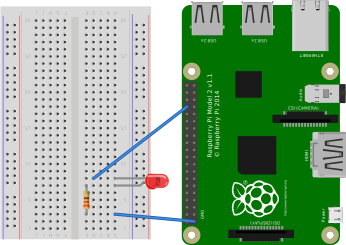

# Raspberry Pi and an LED

This is probably one of the simplest things you can do to demonstrate a Raspberry PI interfacing with a circuit over GPIO.

It connects the GPIO directly to the board but you could go via the power rail.



## Code

Code is so small including it here as well.

```python
import RPi.GPIO as GPIO

GPIO.setmode(GPIO.BCM)
GPIO.setup(18, GPIO.OUT)

led_state = False

try:
    while True:
        GPIO.output(18, led_state)

        if led_state:
            print("The LED is on. Press 'enter' to switch it off")
        else:
            print("The LED is off. Press 'enter' to switch it on")

        arg = input("Press 'q' then 'enter' to quit.")
        if arg == "q":
            exit()
        elif led_state:
            led_state = False
        else:
            led_state = True
finally:
    GPIO.cleanup()
```

## Reference

This is a straight up taken from [Connecting an LED To Raspberry Pi](https://youtu.be/BWYy3qZ315U). I have provided a refactoring of the code they provide though to make it a little easier to interact with and ensure `cleanup()` is run.
