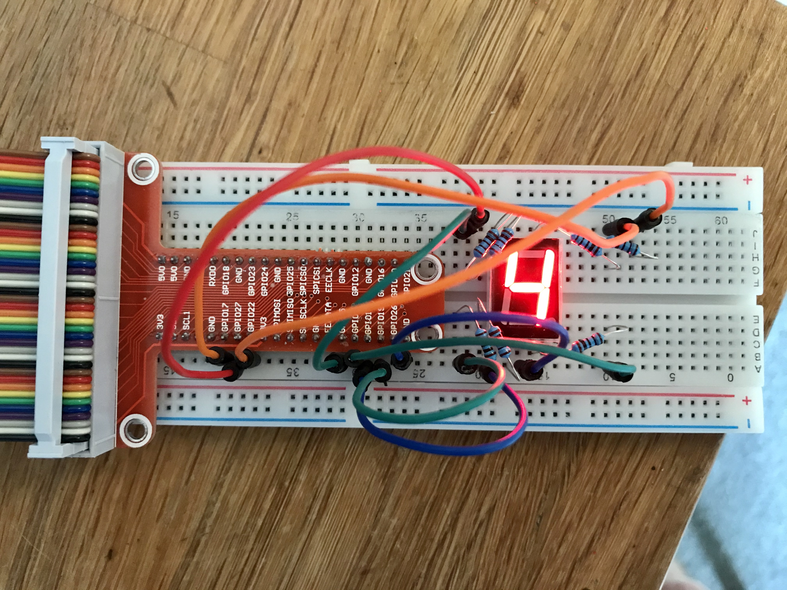

# Raspberry Pi and a 7 segment display

This is a simple demonstration of a 7 segment display. Though it actually involves a more complex circuit and program than in my other simple projects.

A 7 segment display is really just 7 LED's (8 if you have one with a decimal point) packaged as a single component. Getting characters to display is a case of controlling which LED's or segments to switch on.

The wiring involves connecting each LED via a resistor to a GPIO pin. You then need a program which controls the output of each GPIO pin.


## 7 segment displays

Most folks will refer to each segment as `a,b,c,d,e,f,g` and the dot as either `h` or `dp`. They have 10 pins. Eight connect to the segments. The two middle pins are the common anode/cathode of all the LEDs. These common anode/cathode are internally shorted so we only need to connect to one COM pin.


There are two types of 7 segment displays; Common Anode and Common Cathode.

### Common Cathode

In this all the negative terminals (cathode) of all the LEDs are connected together. All the positive terminals are left alone.

My 7 segment displays are common cathode so I connect the pin between `c` and `d` to `GND` on the GPIO.

### Common Anode

In this all the positive terminals (Anodes) of all the LEDs are connected together. All the negative thermals are left alone.

## Code

This program will cycle through 0 to 9 with a 1 second pause until CTRL+C is pressed.

This is my version of the code provided in the [article](https://www.noumansaleem.com/avr/2018/08/11/seven-segment-display-raspberry-pi-python.html) I referenced for this project. A key difference is I ditched all the bit arrays and bitwise operations it was using for something much simpler (though arguably less elegant).

```python
import RPi.GPIO as GPIO

# Needed to allow the program to `sleep` for 1 second after displaying a digit.
# Else the display will be more like a light show!
import time

GPIO.setmode(GPIO.BCM)

# Dictionary of GPIO pins used and the segment they correspond to
pins = {'a': 17, 'b': 22, 'c': 6, 'd': 13, 'e': 19, 'f': 27, 'g': 5}

# Dictionary of digits to display on the 7 segment display. For each
# digit we hold an array of which segments need to be lit.
digits = {
    0: ['a', 'b', 'c', 'd', 'e', 'f'],
    1: ['b', 'c'],
    2: ['a', 'b', 'g', 'e', 'd'],
    3: ['a', 'b', 'c', 'd', 'g'],
    4: ['b', 'c', 'f', 'g'],
    5: ['a', 'c', 'd', 'f', 'g'],
    6: ['a', 'c', 'd', 'e', 'f', 'g'],
    7: ['a', 'b', 'c'],
    8: ['a', 'b', 'c', 'd', 'e', 'f', 'g'],
    9: ['a', 'b', 'c', 'f', 'g']
}


def renderDigit(digit):
    # Turn off all the segments
    GPIO.output(list(pins.values()), GPIO.LOW)

    # Get the array of segments that need switching on for this digit
    digitSegments = digits[digit]

    # Iterate through the array of segments, locate the corresponding GPIO pin
    # and by setting it to GPIO.HIGH, turn on the segment
    for segment in digitSegments:
        GPIO.output(pins[segment], GPIO.HIGH)


try:
    # Tell RPi we won't be reading from the pins. Instead will be sending data
    # out (by way of whether the voltage is high or low)
    GPIO.setup(list(pins.values()), GPIO.OUT)

    # Turn off all the segments
    GPIO.output(list(pins.values()), GPIO.LOW)

    # Start by displaying 0
    digit = 0

    # Just keep looping until the CTRL+C is entered
    while True:
        renderDigit(digit)
        print("Displaying " + str(digit))

        # If digit is 9 reset to 0, else just add 1 to it
        digit = 0 if digit == 9 else (digit + 1)

        # Sleep for 1 second, to give us a chance to see the digit displayed
        time.sleep(1)
except KeyboardInterrupt:
    print("Goodbye")
finally:
    GPIO.cleanup()

```

## Reference

I mainly referred to [seven-segment-display-raspberry-pi-python](https://www.noumansaleem.com/avr/2018/08/11/seven-segment-display-raspberry-pi-python.html) for this project. It uses a 4 digit 7 segment display component though. So I also used [7 Segment displays](https://circuitdigest.com/article/7-segment-display) as a reference for the pin placement.

## Proof!

The actual circuit and code in operation.


