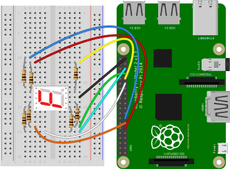
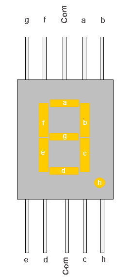

# Raspberry Pi and a 7 segment display

This is a simple demonstration of a 7 segment display. Though it actually involves a more complex circuit and program than in my other simple projects.

A 7 segment display is really just 7 LED's (8 if you have one with a decimal point) packaged as a single component. Getting characters to display is a case of controlling which LED's or segments to switch on.

The wiring involves connecting each LED via a resistor to a GPIO pin. You then need a program which controls the output of each GPIO pin.



## 7 segment displays

Most folks will refer to each segment as `a,b,c,d,e,f,g` and the dot as either `h` or `dp`. They have 10 pins. Eight connect to the segments. The two middle pins are the common anode/cathode of all the LEDs. These common anode/cathode are internally shorted so we only need to connect to one COM pin.



There are two types of 7 segment displays; Common Anode and Common Cathode.

### Common Cathode

In this all the negative terminals (cathode) of all the LEDs are connected together. All the positive terminals are left alone.

My 7 segment displays are common cathode so I connect the pin between `c` and `d` to `GND` on the GPIO.

### Common Anode

In this all the positive terminals (Anodes) of all the LEDs are connected together. All the negative thermals are left alone.

## Code

This program will cycle through 0 to 9 with a 1 second pause until CTRL+C is pressed.

It maps each digit (number) to a bit array. We'll need 7 bits to represent each segment `a` to `g`. A value of `1` means **on**, `0` means **off**.

In this example the bit array has a length of 8 and the right most represents segment `a`. Check out these examples that illustrate this.

- `0x00000001` Segment `a` is on
- `0x00000110` Segments `b` and `c` are on
- `0x01111111` All 7 segments (`a`-`g`) are on

```python
import time
import RPi.GPIO as GPIO

GPIO.setmode(GPIO.BCM)

digitBitmap = {0: 0b00111111, 1: 0b00000110, 2: 0b01011011, 3: 0b01001111, 4: 0b01100110,
               5: 0b01101101, 6: 0b01111101, 7: 0b00000111, 8: 0b01111111, 9: 0b01100111}
masks = {'a': 0b00000001, 'b': 0b00000010, 'c': 0b00000100,
         'd': 0b00001000, 'e': 0b00010000, 'f': 0b00100000, 'g': 0b01000000}
pins = {'a': 17, 'b': 22, 'c': 6, 'd': 13, 'e': 19, 'f': 27, 'g': 5}


def renderChar(c):
    val = digitBitmap[c]

    GPIO.output(list(pins.values()), GPIO.LOW)

    for k, v in masks.items():
        if val & v == v:
            GPIO.output(pins[k], GPIO.HIGH)


try:
    GPIO.setup(list(pins.values()), GPIO.OUT)
    GPIO.output(list(pins.values()), GPIO.LOW)

    val = 0

    while True:
        print("Printing " + str(val))
        renderChar(val)
        val = 0 if val == 9 else (val + 1)
        time.sleep(1)
except KeyboardInterrupt:
    print("Goodbye")
finally:
    GPIO.cleanup()

```

## Reference

I mainly referred to [seven-segment-display-raspberry-pi-python](https://www.noumansaleem.com/avr/2018/08/11/seven-segment-display-raspberry-pi-python.html) for this project. It uses a 4 digit 7 segment display component though. So I also used [7 Segment displays](https://circuitdigest.com/article/7-segment-display) as a reference for the pin placement.
